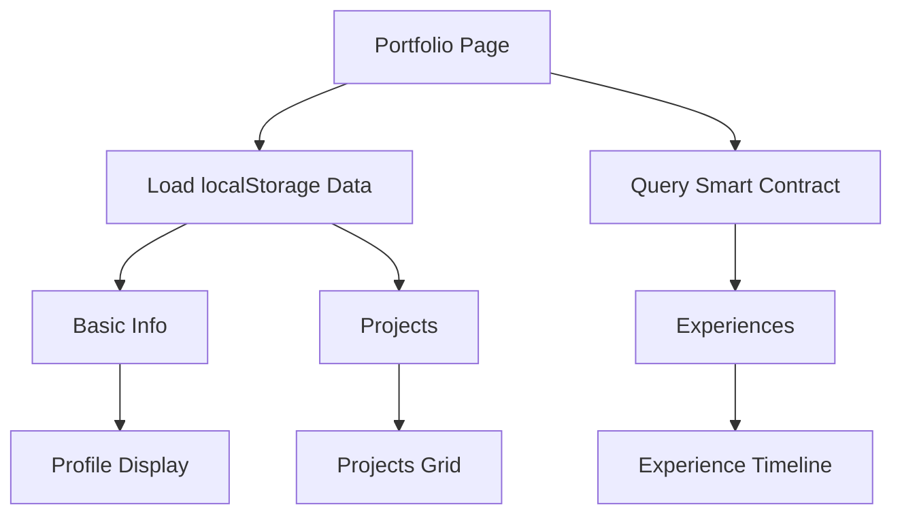

## Overview

The portfolio page serves as the central hub for displaying your professional profile, combining:

- **Basic Information**: Profile details and social links (hardcoded/localStorage)
- **Work Experiences**: On-chain data from the smart contract
- **Projects**: Off-chain data stored in localStorage

## Portfolio Page Structure

The portfolio is built with a responsive two-column layout:

<CodeGroup>
```javascript src/app/portfolio/page.js
export default function PortfolioPage() {
  const { address } = useAccount();
  const [portfolioData, setPortfolioData] = useState();

  // Fetch on-chain experiences
  const { data: isAccountData } = useReadContract({
    abi,
    address: CONTRACT_ADDRESS,
    functionName: "getAllWork",
    args: [],
  });

  // Load off-chain data from localStorage
  useEffect(() => {
    const basicInfo = JSON.parse(
      localStorage.getItem("portfolioBasicInfo") || "{}"
    );
    const experiences = JSON.parse(
      localStorage.getItem("portfolioExperiences") || "[]"
    );
    const projects = JSON.parse(
      localStorage.getItem("portfolioProjects") || "[]"
    );
    setPortfolioData({ basicInfo, experiences, projects });
  }, []);

  return (
    <div className="min-h-screen">
      <div className="grid gap-6 md:grid-cols-[2fr_3fr]">
        {/* Left Column: Profile Card */}
        {/* Right Column: Experiences & Projects */}
      </div>
    </div>
  );
}
```
</CodeGroup>

## Left Column: Profile Card

The left column displays your professional profile with:

### Profile Information

<Frame>
  
</Frame>

```jsx
<Card className="glass md:sticky md:top-20 md:h-fit">
  <CardContent className="p-6">
    <div className="flex flex-col items-center text-center">
      
      <h1 className="text-2xl font-bold">
        {portfolioData.basicInfo.name || "Your Name"}
      </h1>
      <p className="text-gray-400 mb-4">
        {portfolioData.basicInfo.bio}
      </p>
    </div>
  </CardContent>
</Card>
```

### Social Links

Connect with profile visitors through social media:

```jsx
<div className="flex space-x-4 mb-4">
  <a href="https://x.com/Bhopal_Dao" target="_blank">
    <Button variant="outline" size="icon">
      <Twitter className="h-4 w-4" />
    </Button>
  </a>
  <a href="https://www.linkedin.com/company/bhopal-dao/" target="_blank">
    <Button variant="outline" size="icon">
      <Linkedin className="h-4 w-4" />
    </Button>
  </a>
</div>
```

### Skills Display

Showcase your technical skills with badge components:

```jsx
<div className="flex flex-wrap gap-2 justify-center">
  {["Blockchain", "Smart Contracts", "Web3", "DeFi"].map((skill, index) => (
    <Badge
      key={index}
      variant="secondary"
      className="bg-gradient-to-r from-cyan-500 to-blue-500 text-white"
    >
      {skill}
    </Badge>
  ))}
</div>
```

<Note>
  Currently, profile information and skills are hardcoded. Future versions will support dynamic profile management.
</Note>

## Right Column: Content Sections

The right column displays your professional content in two main sections:

### Experience Section (On-Chain)

Work experiences are stored on the blockchain and retrieved using Wagmi's `useReadContract` hook:

```javascript
const { data: isAccountData } = useReadContract({
  abi,
  address: CONTRACT_ADDRESS,
  functionName: "getAllWork",
  args: [],
});
```

#### Displaying Experiences

```jsx
<Card className="glass overflow-hidden">
  <CardContent className="p-0">
    <div className="bg-gradient-to-r from-purple-500 to-pink-500 p-4">
      <h2 className="text-xl font-semibold flex items-center text-white">
        <Briefcase className="mr-2" /> Experience
      </h2>
    </div>
    <div className="p-4 space-y-4">
      {isAccountData?.map((exp, index) => (
        <div key={index} className="bg-gray-800/50 rounded-xl p-6">
          <div className="flex justify-between items-start mb-4">
            <h3 className="text-xl font-semibold">{exp.role}</h3>
            <Badge variant="outline" className="border-pink-500">
              {exp.company}
            </Badge>
          </div>
          <p className="text-gray-300 mb-4">{exp.description}</p>
          <a
            href={exp.link}
            target="_blank"
            rel="noopener noreferrer"
            className="inline-flex items-center gap-2 px-4 py-2 rounded-lg bg-gradient-to-r from-purple-500 to-pink-500 text-white"
          >
            View Project <ExternalLink className="h-4 w-4" />
          </a>
        </div>
      ))}
    </div>
  </CardContent>
</Card>
```

<Info>
  Experience data is immutably stored on the Sepolia blockchain. See [Experience Tracking](/features/experience-tracking) for details on adding experiences.
</Info>

### Projects Section (Off-Chain)

Projects are stored in browser localStorage for quick access:

```jsx
<Card className="glass overflow-hidden">
  <CardContent className="p-0">
    <div className="bg-gradient-to-r from-blue-500 to-cyan-500 p-4">
      <h2 className="text-xl font-semibold flex items-center text-white">
        <FolderGit2 className="mr-2" /> Projects
      </h2>
    </div>
    <div className="p-4 grid gap-4 md:grid-cols-2">
      {portfolioData.projects.map((project, index) => (
        <div key={index} className="bg-gray-800 rounded-lg p-4">
          <h3 className="font-semibold text-cyan-400 flex items-center justify-between">
            {project.name}
            <a href={project.link} target="_blank">
              <ExternalLink className="h-4 w-4" />
            </a>
          </h3>
          <p className="mt-2 text-gray-300 text-sm">
            {project.description}
          </p>
        </div>
      ))}
    </div>
  </CardContent>
</Card>
```

<Warning>
  localStorage data is browser-specific and will be lost if you clear your browser data. Future versions may include on-chain project storage.
</Warning>

## Data Flow Diagram



## Navigation & Actions

The portfolio header includes key navigation and actions:

```jsx src/app/portfolio/page.js
<header className="sticky top-0 z-40">
  <div className="container flex h-14 items-center">
    <div className="justify-center w-full hidden md:flex">
      <ConnectButton />
    </div>
    <div className="flex items-center justify-between">
      <Link href="/form/experience">
        <Button className="gradient-button text-white">
          <span>Add Experience</span>
        </Button>
      </Link>
      <ThemeToggle />
    </div>
  </div>
</header>
```

<CardGroup cols={3}>
  <Card title="Connect Wallet" icon="wallet">
    RainbowKit button for wallet connection
  </Card>
  <Card title="Add Experience" icon="plus">
    Quick access to add new work experiences
  </Card>
  <Card title="Theme Toggle" icon="moon">
    Switch between light and dark mode
  </Card>
</CardGroup>

## Loading States

The portfolio handles loading gracefully:

```javascript
if (!portfolioData) {
  return <div>Loading...</div>;
}
```

<Tip>
  Consider implementing skeleton loaders or more sophisticated loading states for better UX.
</Tip>

## Styling & Theme

The portfolio uses a modern glass morphism design with:

- Gradient backgrounds (`from-gray-900 to-black`)
- Glass effect cards (`.glass` class)
- Gradient text (`from-purple-400 to-pink-600`)
- Smooth transitions and hover effects

```css
.glass {
  background: rgba(255, 255, 255, 0.1);
  backdrop-filter: blur(10px);
  border: 1px solid rgba(255, 255, 255, 0.2);
}

.gradient-button {
  background: linear-gradient(to right, #a855f7, #ec4899);
}
```

## Data Storage Comparison

<CardGroup cols={2}>
  <Card title="On-Chain (Experiences)" icon="link">
    - Immutable and verifiable
    - Requires wallet connection
    - Gas fees for transactions
    - Permanently stored
    - Accessible from any device
  </Card>
  <Card title="Off-Chain (Projects)" icon="hard-drive">
    - No gas fees
    - Instant updates
    - Browser-specific
    - Can be lost if data cleared
    - No wallet required
  </Card>
</CardGroup>

## Next Steps

<CardGroup cols={2}>
  <Card title="Add Experiences" icon="briefcase" href="/features/experience-tracking">
    Learn how to add work experiences on-chain
  </Card>
  <Card title="Add Projects" icon="folder" href="/features/project-showcase">
    Learn how to showcase your projects
  </Card>
  <Card title="Smart Contract" icon="file-code" href="/contracts/portfolio-contract">
    Understand the underlying smart contract
  </Card>
  <Card title="Customize" icon="palette" href="/development/configuration">
    Customize your portfolio appearance
  </Card>
</CardGroup>